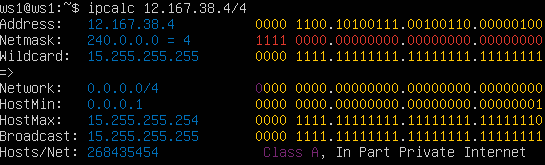
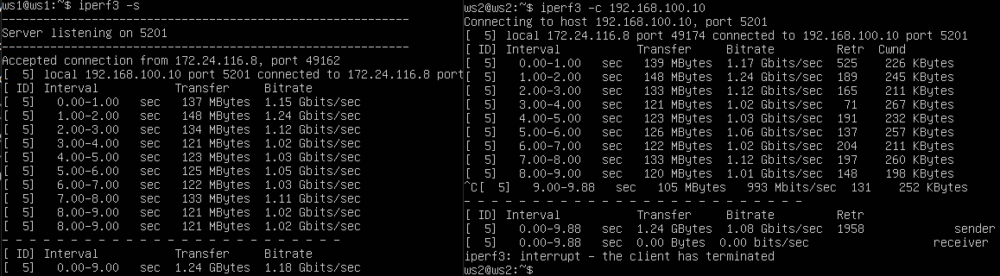
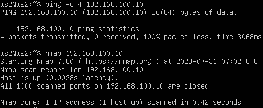
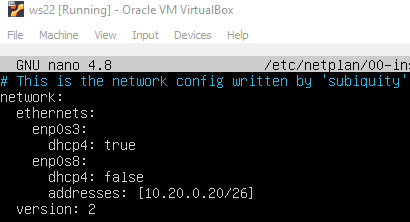
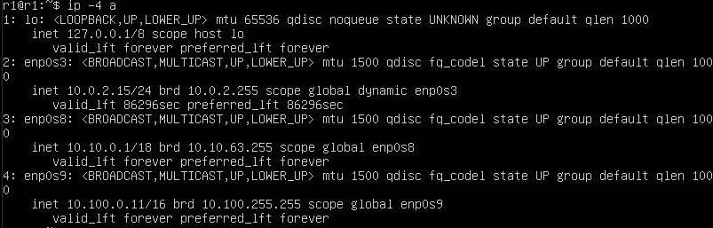
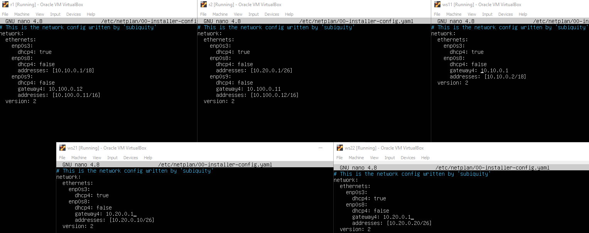
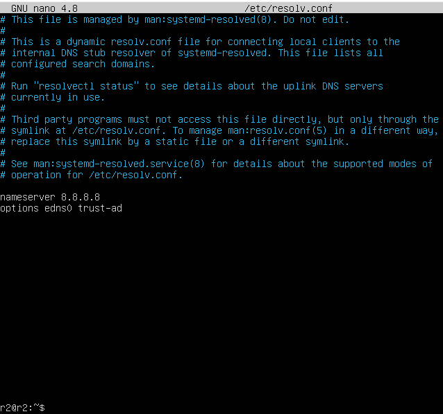
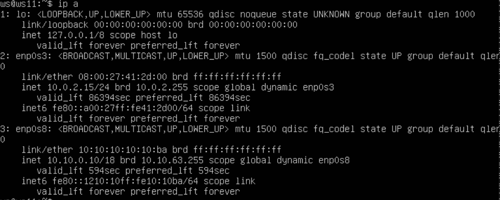
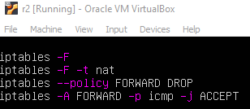
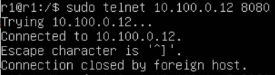

# Сети в Linux

1. [Инструмент ipcalc](#part-1-инструмент-ipcalc)
2. [Статическая маршрутизация между двумя машинами](#part-2-статическая-маршрутизация-между-двумя-машинами)
3. [Утилита iperf3](#part-3-утилита-iperf3)
4. [Сетевой экран](#part-4-сетевой-экран)
5. [Статическая маршрутизация сети](#part-5-статическая-маршрутизация-сети)
6. [Динамическая настройка IP с помощью DHCP](#part-6-динамическая-настройка-ip-с-помощью-dhcp)
7. [NAT](#part-7-nat)
8. [Допополнительно. Знакомство с SSH Tunnels](#part-8-дополнительно-знакомство-с-ssh-tunnels)

## Part 1. Инструмент **ipcalc**

##### Поднять виртуальную машину (далее -- ws1)

- `sudo hostnamectl set-hostname ws1`

#### 1.1. Сети и маски

- `sudo apt install ipcalc`

##### Определить и записать в отчёт:

##### 1) адрес сети *192.167.38.54/13*

- `ipcalc -b 192.167.38.54/13`


 - Флаг `-b` позволяет скрыть двоичный вывод.

##### 2) перевод маски *255.255.255.0* в префиксную и двоичную запись, */15* в обычную и двоичную, *11111111.11111111.11111111.11110000* в обычную и префиксную

- `ipcalc 255.255.255.0`


Префиксная запись - `/24`. Двоичная запись - `11111111.11111111.11111111.00000000`

- `ipcalc /15`


Обычная запись - `255.254.0.0`. Двоичная запись - `11111111.11111110.00000000.00000000`

- `ipcalc 192.167.38.54/28`


Обычная запись - `255.255.255.240`. Префиксная запись - `/28`

##### 3) минимальный и максимальный хост в сети *12.167.38.4* при масках: */8*, *11111111.11111111.00000000.00000000*, *255.255.254.0* и */4*

- `ipcalc 12.167.38.4/8`


Минимальный хост - `12.0.0.1`. Максимальный хост - `12.255.255.254`

- `ipcalc 12.167.38.4/16`


Минимальный хост - `12.167.0.1`. Максимальный хост - `12.167.255.254`

- `ipcalc 12.167.38.4/23`


Минимальный хост - `12.167.38.1`. Максимальный хост - `12.167.39.254`

- `ipcalc 12.167.38.4/4`



Минимальный хост - `0.0.0.1`. Максимальный хост - `15.255.255.254`

#### 1.2. localhost

##### Определить и записать в отчёт, можно ли обратиться к приложению, работающему на localhost, со следующими IP: *194.34.23.100*, *127.0.0.2*, *127.1.0.1*, *128.0.0.1*

- localhost («местный» от англ. local — этот компьютер) — стандартное, официально зарезервированное доменное имя для частных IP-адресов в диапазоне 127.0.0.1 — 127.255.255.254.

- `ipcalc 194.34.23.100`


Интерфейс Loopback отсутствует в строке `Hosts/Net`, следовательно данный адрес нам не подходит.

- `ipcalc 127.0.0.2`


Loopback присутствует, следовательно адрес нам подходит.

- `ipcalc 127.1.0.1`


Loopback присутствует, следовательно адрес нам подходит.

- `ipcalc 128.0.0.1`


Интерфейс Loopback отсутствует в строке `Hosts/Net`, следовательно данный адрес нам не подходит.

#### 1.3. Диапазоны и сегменты сетей

##### Определить и записать в отчёт:

##### 1) какие из перечисленных IP можно использовать в качестве публичного, а какие только в качестве частных: *10.0.0.45*, *134.43.0.2*, *192.168.4.2*, *172.20.250.4*, *172.0.2.1*, *192.172.0.1*, *172.68.0.2*, *172.16.255.255*, *10.10.10.10*, *192.169.168.1*

- `ipcalc <ip адрес>` 

(чтобы не нагромождать скринами, пишу словами.)
```bash
10.0.0.45/8       - Privat
134.43.0.2/16     - Public
192.168.4.2/16    - Privat
172.20.250.4/12   - Privat
172.0.2.1/12      - Public
192.172.0.1/12    - Public
172.68.0.2/12     - Public
172.16.255.255/12 - Privat
10.10.10.10/8     - Privat
192.169.168.1/16  - Public
```

##### 2) какие из перечисленных IP адресов шлюза возможны у сети *10.10.0.0/18*: *10.0.0.1*, *10.10.0.2*, *10.10.10.10*, *10.10.100.1*, *10.10.1.255*

- `ipcalc -b 10.10.0.0/18`


Возможны адреса `10.10.0.2`, `10.10.10.10` и `10.10.1.255`

## Part 2. Статическая маршрутизация между двумя машинами

##### Поднять две виртуальные машины (далее -- ws1 и ws2)

- `sudo hostnamectl set-hostname ws2`

##### С помощью команды `ip a` посмотреть существующие сетевые интерфейсы


##### Описать сетевой интерфейс, соответствующий внутренней сети, на обеих машинах и задать следующие адреса и маски: ws1 - *192.168.100.10*, маска */16*, ws2 - *172.24.116.8*, маска */12*

- `в виртуал боксе открыть настройки машин открыть там настройки сетей и включить адаптер 2 там выбрать пункт “внутренняя сеть».`

- `sudo nano /etc/netplan/00-installer-config.yaml`


##### Выполнить команду `sudo netplan apply` для перезапуска сервиса сети

#### 2.1. Добавление статического маршрута вручную

##### Добавить статический маршрут от одной машины до другой и обратно при помощи команды вида `ip r add`


##### Пропинговать соединение между машинами


#### 2.2. Добавление статического маршрута с сохранением

##### Перезапустить машины

- `reboot`

##### Добавить статический маршрут от одной машины до другой с помощью файла *etc/netplan/00-installer-config.yaml*


##### Пропинговать соединение между машинами


## Part 3. Утилита **iperf3**

#### 3.1. Скорость соединения

##### Перевести и записать в отчёт: 8 Mbps в MB/s, 100 MB/s в Kbps, 1 Gbps в Mbps

- 8 Mbps = 1 MB/s
- 100 MB/s = 819200 Kbps
- 1 Gbps = 1024 Mbps

#### 3.2. Утилита **iperf3**

##### Измерить скорость соединения между ws1 и ws2

- `iperf3 -s`

- `iperf3 -c 192.168.100.10`



## Part 4. Сетевой экран

#### 4.1. Утилита **iptables**

##### Создать файл */etc/firewall.sh*, имитирующий фаерволл, на ws1 и ws2:

- `sudo nano /etc/firewall.sh`

##### Нужно добавить в файл подряд следующие правила:
##### 1) на ws1 применить стратегию когда в начале пишется запрещающее правило, а в конце пишется разрешающее правило (это касается пунктов 4 и 5)
##### 2) на ws2 применить стратегию когда в начале пишется разрешающее правило, а в конце пишется запрещающее правило (это касается пунктов 4 и 5)
##### 3) открыть на машинах доступ для порта 22 (ssh) и порта 80 (http)
##### 4) запретить *echo reply* (машина не должна "пинговаться”, т.е. должна быть блокировка на OUTPUT)
##### 5) разрешить *echo reply* (машина должна "пинговаться")


ws1:


- в начале запрещаем `echo-reply`

ws2: 


- в конце запрещаем `echo-reply`

##### Запустить файлы на обеих машинах командами `chmod +x /etc/firewall.sh` и `/etc/firewall.sh`


- Разница между стратегиями заключается в том, что в первом файле первым подходящим правилом для пакета является запрет, а во втором - разрешение. Применяется только первое подходящее правило, остальные игнорируются.

#### 4.2. Утилита **nmap**

##### Командой **ping** найти машину, которая не "пингуется", после чего утилитой **nmap** показать, что хост машины запущен
*Проверка: в выводе nmap должно быть сказано: `Host is up`*



## Part 5. Статическая маршрутизация сети


##### Поднять пять виртуальных машин (3 рабочие станции (ws11, ws21, ws22) и 2 роутера (r1, r2))

#### 5.1. Настройка адресов машин

##### Настроить конфигурации машин в *etc/netplan/00-installer-config.yaml* согласно сети на рисунке.

r1 - 

r2 - 

ws11 - 

ws21 - 

ws22 - 

- `sudo netplan apply`

##### Перезапустить сервис сети. Если ошибок нет, то командой `ip -4 a` проверить, что адрес машины задан верно. Также пропинговать ws22 с ws21. Аналогично пропинговать r1 с ws11.

- ws11 and r1


- r1



- ws21 and ws22


- ws22 and ws21


- r2


#### 5.2. Включение переадресации IP-адресов.

##### Для включения переадресации IP, выполните команду на роутерах:

`sudo sysctl -w net.ipv4.ip_forward=1`


##### Откройте файл */etc/sysctl.conf* и добавьте в него следующую строку:

`net.ipv4.ip_forward = 1`


#### 5.3. Установка маршрута по-умолчанию

##### Настроить маршрут по-умолчанию (шлюз) для рабочих станций. Для этого добавить `default` перед IP роутера в файле конфигураций



##### Вызвать `ip r` и показать, что добавился маршрут в таблицу маршрутизации


##### Пропинговать с ws11 роутер r2 и показать на r2, что пинг доходит. Для этого использовать команду:
`tcpdump -tn -i eth1`


#### 5.4. Добавление статических маршрутов

##### Добавить в роутеры r1 и r2 статические маршруты в файле конфигураций. Пример для r1 маршрута в сетку 10.20.0.0/26:


##### Вызвать `ip r` и показать таблицы с маршрутами на обоих роутерах.


##### Запустить команды на ws11:
`ip r list 10.10.0.0/[маска сети]` и `ip r list 0.0.0.0/0`


- Маршрут по умолчанию имеет более низкий приоритет и срабатывает, когда не найден подходящий маршрут в таблице маршрутизации. Для сети 10.10.0.0 мы создали правило, соответственно используется созданный маршрут. Также можно устанавливать метрику, чтобы менять приоритеты маршрутов.

#### 5.5. Построение списка маршрутизаторов

##### Запустить на r1 команду дампа:
`tcpdump -tnv -i eth0`

##### При помощи утилиты **traceroute** построить список маршрутизаторов на пути от ws11 до ws21


- вывод tcpdump -tnv -i enp0s9 на r1


- Принцип построения пути при помощи traceroute: Для определения промежуточных маршрутизаторов traceroute отправляет серию пакетов данных целевому узлу, при этом каждый раз увеличивая на 1 значение поля TTL («время жизни»). Это поле обычно указывает максимальное количество маршрутизаторов, которое может быть пройдено пакетом. Первый пакет отправляется с TTL, равным 1, и поэтому первый же маршрутизатор возвращает обратно сообщение ICMP, указывающее на невозможность доставки данных. Traceroute фиксирует адрес маршрутизатора, а также время между отправкой пакета и получением ответа (эти сведения выводятся на монитор компьютера). Затем traceroute повторяет отправку пакета, но уже с TTL, равным 2, что позволяет первому маршрутизатору пропустить пакет дальше. Процесс повторяется до тех пор, пока при определённом значении TTL пакет не достигнет целевого узла. При получении ответа от этого узла процесс трассировки считается завершённым.

#### 5.6. Использование протокола **ICMP** при маршрутизации

##### Запустить на r1 перехват сетевого трафика, проходящего через eth0 с помощью команды:
`tcpdump -n -i eth0 icmp`


##### Пропинговать с ws11 несуществующий IP (например, *10.30.0.111*) с помощью команды:
`ping -c 5 10.30.0.111`


## Part 6. Динамическая настройка IP с помощью **DHCP**

##### Для r2 настроить в файле */etc/dhcp/dhcpd.conf* конфигурацию службы **DHCP**:

##### 1) указать адрес маршрутизатора по-умолчанию, DNS-сервер и адрес внутренней сети. 


##### 2) в файле *resolv.conf* прописать `nameserver 8.8.8.8.`



##### Перезагрузить службу **DHCP** командой `systemctl restart isc-dhcp-server`. Машину ws21 перезагрузить при помощи `reboot` и через `ip a` показать, что она получила адрес. Также пропинговать ws22 с ws21.


- Перезагружаем ws21 с помощью команды `sudo reboot`


##### Указать MAC адрес у ws11, для этого в *etc/netplan/00-installer-config.yaml* надо добавить строки: `macaddress: 10:10:10:10:10:BA`, `dhcp4: true`


##### Для r1 настроить аналогично r2, но сделать выдачу адресов с жесткой привязкой к MAC-адресу (ws11). Провести аналогичные тесты

- вносим изменения в файл /etc/dhcp/dhcpd.conf


- вносим изменения в файл /etc/resolv.conf


- перезагружаем службу DHCP


- перезагружаем ws11 и вызываем ip a



- пингуем ws22


##### Запросить с ws21 обновление ip адреса


- вызываем команду `sudo dhclient enp0s8 -r`, потом `sudo dhclient enp0s8`


- `sudo dhclint -r enp0x` удалить IP

- `sudo dhclint  enp0X` назначить IP

## Part 7. **NAT**

##### В файле */etc/apache2/ports.conf* на ws22 и r1 изменить строку `Listen 80` на `Listen 0.0.0.0:80`, то есть сделать сервер Apache2 общедоступным

- `sudo apt inastall apache2 -y`


##### Запустить веб-сервер Apache командой `service apache2 start` на ws22 и r1


##### Добавить в фаервол, созданный по аналогии с фаерволом из Части 4, на r2 следующие правила:

##### 1) удаление правил в таблице filter - `iptables -F`

##### 2) удаление правил в таблице "NAT" - `iptables -F -t nat`

##### 3) отбрасывать все маршрутизируемые пакеты - `iptables --policy FORWARD DROP`


##### Запускать файл также, как в Части 4


##### Проверить соединение между ws22 и r1 командой `ping`


##### Добавить в файл ещё одно правило:

##### 4) разрешить маршрутизацию всех пакетов протокола **ICMP**



##### Запускать файл также, как в Части 4


##### Проверить соединение между ws22 и r1 командой `ping`


##### Добавить в файл ещё два правила:

##### 5) включить **SNAT**, а именно маскирование всех локальных ip из локальной сети, находящейся за r2 (по обозначениям из Части 5 - сеть 10.20.0.0)

##### 6) включить **DNAT** на 8080 порт машины r2 и добавить к веб-серверу Apache, запущенному на ws22, доступ извне сети


##### Запускать файл также, как в Части 4


##### Проверить соединение по TCP для **SNAT**, для этого с ws22 подключиться к серверу Apache на r1 командой:
`telnet [адрес] [порт]`


##### Проверить соединение по TCP для **DNAT**, для этого с r1 подключиться к серверу Apache на ws22 командой `telnet` (обращаться по адресу r2 и порту 8080)



## Part 8. Дополнительно. Знакомство с **SSH Tunnels**

- `sudo apt-get install openssh-server`

##### Запустить на r2 фаервол с правилами из Части 7


##### Запустить веб-сервер **Apache** на ws22 только на localhost (то есть в файле */etc/apache2/ports.conf* изменить строку `Listen 80` на `Listen localhost:80`)


##### Воспользоваться *Local(-L) TCP forwarding* с ws21 до ws22, чтобы получить доступ к веб-серверу на ws22 с ws21

- добавить пользователя ws21 на машину ws22


##### Воспользоваться *Remote(-R) TCP forwarding* c ws11 до ws22, чтобы получить доступ к веб-серверу на ws22 с ws11

- добавить пользователя ws11 на машину ws22


##### Для проверки, сработало ли подключение в обоих предыдущих пунктах, перейдите во второй терминал (например, клавишами Alt + F2) и выполните команду:
`telnet 127.0.0.1 [локальный порт]`


